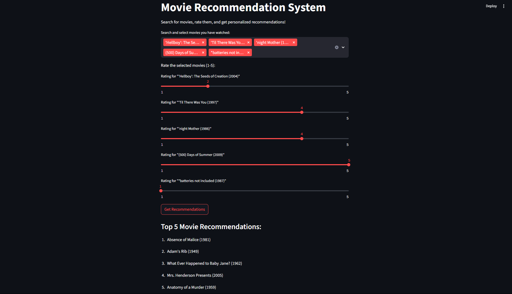

# Movie Recommendation System

This project is a Netflix-style movie recommendation engine using collaborative filtering. It features an interactive Streamlit web app for personalized movie suggestions.

## Features
- Item-based collaborative filtering using cosine similarity
- Interactive Streamlit app: search, rate movies, and get recommendations
- Easily switch to new datasets (e.g., Bollywood movies)

## Dataset
- Default: Uses MovieLens-style datasets (e.g., `data/new_data/ratings.csv` and `movies.csv`)
- You can use your own dataset by replacing these files with the same format:
  - `ratings.csv`: `userId,movieId,rating`
  - `movies.csv`: `movieId,title,genres`

## Setup
1. **Clone the repository** and navigate to the project folder.
2. **Install dependencies:**
   ```bash
   pip install -r requirements.txt
   ```
3. **Add your dataset:**
   - Place your `ratings.csv` and `movies.csv` in `data/new_data/`.

## Usage
### Run the Streamlit App
```bash
streamlit run app.py
```
- Search and select movies you’ve watched
- Rate them (1–5)
- Click "Get Recommendations" to see personalized suggestions

### Run the Recommendation Script
```bash
python recommender.py
```
- Prints sample recommendations for a user in the console

## Output Screenshot

Below is a screenshot of the Movie Recommendation System Streamlit app in action:



## Using a Custom Dataset (e.g., Bollywood Movies)
- Download or create a dataset with the columns:
  - `ratings.csv`: `userId,movieId,rating`
  - `movies.csv`: `movieId,title,genres`
- Place them in `data/new_data/` and restart the app.

## Notes
- For Bollywood datasets, you may need to collect or simulate user ratings if not available.
- The system can be adapted for content-based filtering if only movie metadata is available.

## License
This project is for educational/demo purposes. 
